# Geração Procedural de Texturas com Coherent Noise

## Tutorial libnoise

Tutoriais 2 a 8 =>
[Link aqui](https://libnoise.sourceforge.net/tutorials/index.html)

## Resultados

### Geração de mapas vizinhos

| | |
|----------|----------|
| 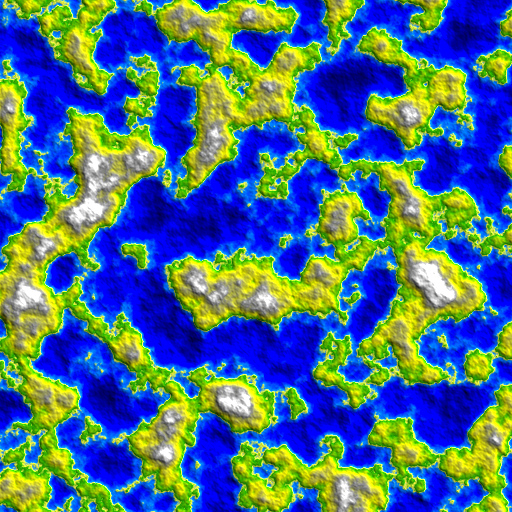 | 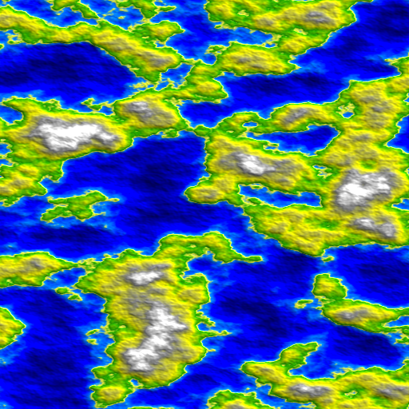 |
|  | 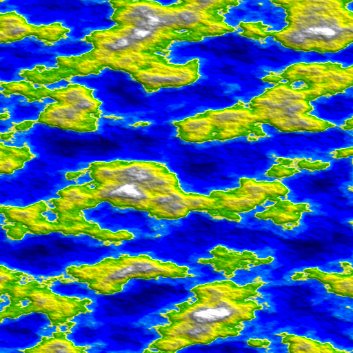 | 

### Explorando números diferentes de `oitavas`

o ruído Perlin é a soma de várias funções de ruído coerente com frequências cada vez maiores e amplitudes cada vez menores. Cada uma dessas funções é chamada de oitava, porque cada oitava tem o dobro da frequência da oitava anterior.

| Octave 1 | Octave 6 |
|----------|----------|
| 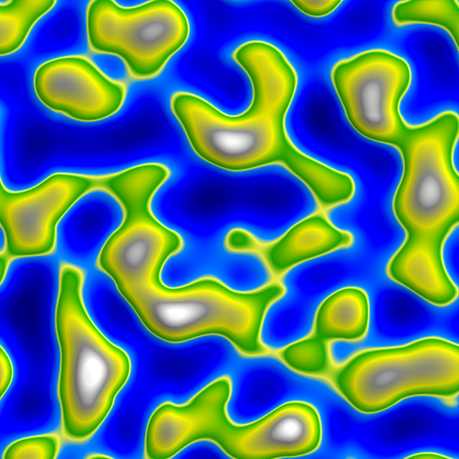 |  |

### Explorando números diferentes de `frequência`

A frequência determina quantas mudanças ocorrem ao longo de uma unidade de comprimento. Aumentar a frequência aumentará o número de feições do terreno (e também diminuirá o tamanho dessas feições) em um mapa de altura do terreno.

| Frequência 1 | Frequência 16 |
|----------|----------|
| 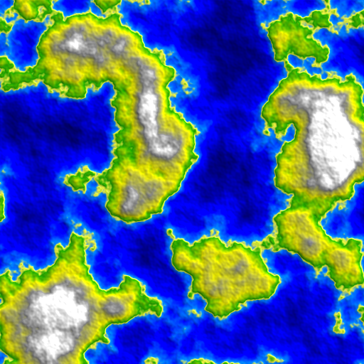 | 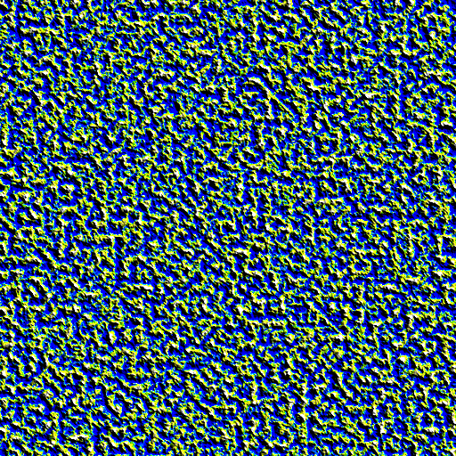 |

### Explorando números diferentes de `persistência`

O valor de `persistência` determina a rapidez com que as amplitudes caem para cada oitava sucessiva. Aumentar o valor de persistência criará um mapa de altura de terreno mais acidentado, enquanto diminuir o valor de persistência criará um mapa de altura mais suave.

| Persistência 0 | Persistência 0.5 | Persistência 1 |
|----------|----------|----------|
|  | 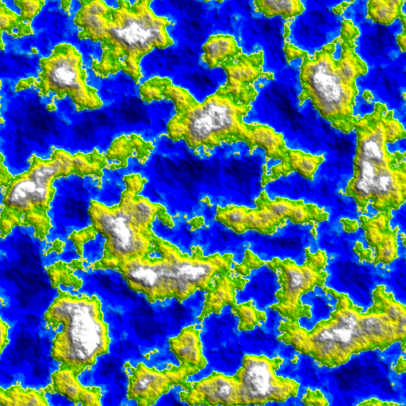 | 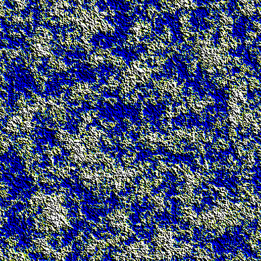 |

### 2 diferentes mapeamentos de biomas

| Mapa | Terreno montanhoso | 
|----------|----------|
|  | 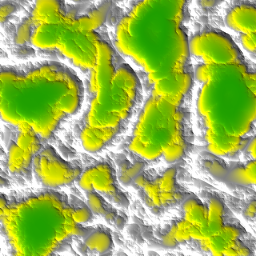 

## Rodando a aplicação

### Adicionar Diretórios de inclusão adicionais

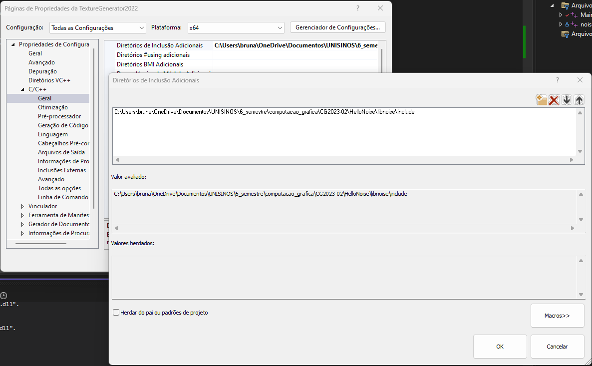

### Adicionar Diretórios de biblioteca adicionais

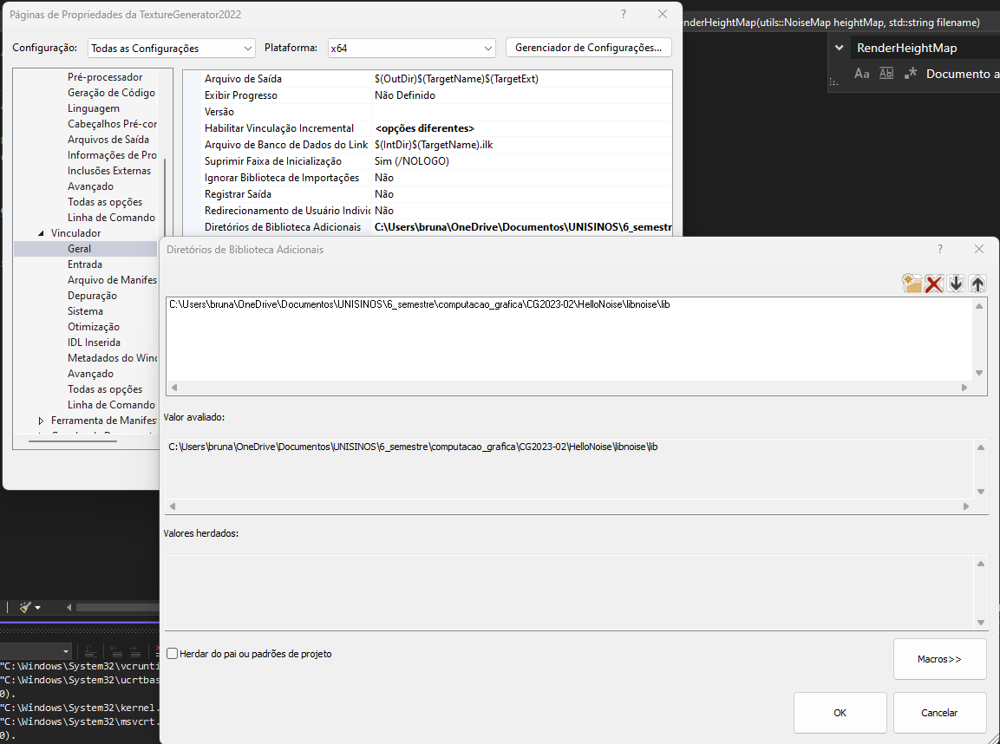

### Adicionar Dependências adicionais

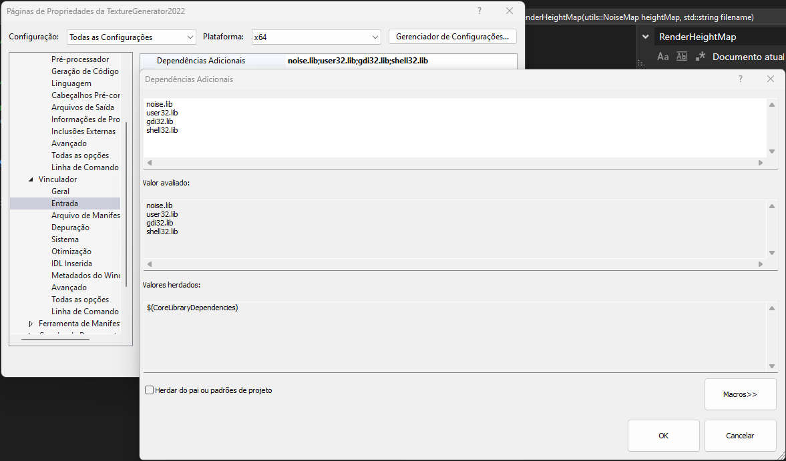

### Adicionar o arquivo `noise.dll` na pasta `Debug`

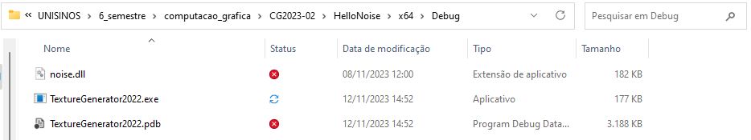